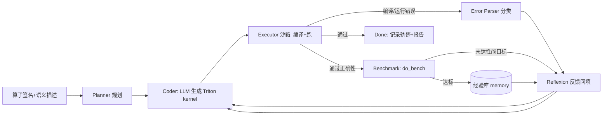

# Triton Kernel Generation Agent — 两周备战计划

> 📌 **进度（2026-09-06 Day2，超前 10+ 天）**：M1 稳健评测 **12/12 通过**（4 算子 × repeat 3，平均 1.7 轮，fp32+fp16 多 case 判卷）；双 critic 性能闭环；RAG 经验库 v1（memory.py）骨架完成；§10 方向②失败回灌已实现 v1（2026-09-08，见 §11）。计划内已覆盖 Day1–5/7/8–9/11–12；剩 D6(可选角色拆分)、D13–14(demo/简历)。见 §8/§10。

> 目标岗位：大模型算法 / Agent 应用
> 前置背景：写过/读过一些 Triton；LLM API 驱动（DeepSeek/OpenAI 兼容）
> 可用时间：约 4–6 h/天（总计 ~70 h）
> 项目定位（简历一句话）：
> **基于 LLM 的自主 Triton kernel 生成与优化 Agent** —— 输入 PyTorch 算子的签名/语义描述，自动规划、生成 Triton kernel，并通过「编译 → 正确性 → 性能」三重工具反馈驱动 Reflexion 式自我迭代，直到通过数值对齐并达到性能目标。

---

## 0. 前置检查（开工前必须确认，半天）

- [ ] 有可用的 NVIDIA GPU（`nvidia-smi` 可用，显存 ≥ 8G）
- [ ] `torch`(>=2.x) + `triton` 装好且版本匹配，能 import 并跑通一个最小 kernel
- [ ] LLM API key（DeepSeek 国内方便且便宜；OpenAI 兼容格式）
- [ ] git 初始化，确定用哪个 conda/venv 环境

> ⚠️ 没有 GPU 是硬性 blocker，Triton 在 CPU 上基本无法实战。先确认再往下走。

---

## 1. 总体策略（先讲清楚为什么这么做）

你投的是 **Agent 岗**，不是 AI Infra 岗。所以：

- **卖点是 agent 架构能力**：tool-use（执行/编译/基准测试）、多轮自我纠错（Reflexion）、可观测轨迹、成本控制。Triton 只是"验证沙箱"。
- **不要沉进编译器深水区**（tuning 数万核、研究级 flash-attention 等是 AI Infra 方向才需要的），两周内浅尝辄止即可。
- **用机器可量化的指标给 agent 打分**：正确性（vs PyTorch eager）、性能（vs torch.compile / eager）。这是你项目区别于"玩具对话 agent"的核心竞争力。
- **尽量自写 orchestrator，不套 LangChain/LangGraph 大框架**。面试时你能把每个角色（planner/coder/critic）和循环讲透，框架反而削弱说服力。

### 里程碑（3 个硬性验收点）

| 里程碑 | 时间 | 验收标准 |
|---|---|---|
| M1 正确性闭环 | Day 1–7 | 5 个算子中 ≥4 个能由 agent 自动生成**通过数值对齐**的 kernel；平均迭代 ≤3 轮 |
| M2 性能闭环 | Day 8–11 | 跑出可信对比表（vs eager / torch.compile），kernel 有可复现的 benchmark |
| M3 交付打磨 | Day 12–14 | README + 架构图 + 轨迹记录 + demo 脚本 + 简历条目 + 面试问答 |

---

## 2. 两周 Day-by-Day

### Week 1 — 把"自动生成 + 自动验证"的闭环跑通

| 天 | 内容 | 产出 |
|---|---|---|
| D1 | 环境验证；Triton 手写热身（vector add / elementwise / 一个 reduce）；搭 repo 骨架 | 最小 kernel 跑通；项目结构就位 |
| D2 | **定义 benchmark 集（这是地基）**：选 5 个算子，写 golden 正确性检查脚手架（`torch.allclose`）与输入生成器；手写 reference Triton 留存（只作答案，不喂给 agent） | `benchmarks/` 各算子 runner 跑通 |
| D3 | **Agent v0 最小闭环**：LLM 生成 kernel → 落盘 → 独立子进程编译+正确性 run → 返回 pass/fail | 固定 prompt 单轮生成能跑通 1 个算子 |
| D4 | **错误反馈解析器**：把编译错误 / 运行错误 / 数值错误分类成可消化文本；加自动重试（最多 K 轮） | 简单算子能自动迭代到正确 |
| D5 | **Reflexion 反思循环 v1**：按错误类别组织历史反馈回填 prompt；把"Triton 生成规范"沉淀进 system prompt | 记录轨迹 jsonl；成功率明显上升 |
| D6 | 抽出 **planner / coder / critic 角色模块**（体现 agent 架构）；加 mock LLM 便于离线调试 | 架构清晰、可离线单测 |
| D7 | **M1 验收**：5 个算子全量跑，统计成功率/平均轮数/耗时；处理 triton API 版本坑（`libdevice` 导入、`tl.max` 返回值、`num_warps` 等） | M1 指标表 |

### Week 2 — 性能闭环 + 打磨交付

| 天 | 内容 | 产出 |
|---|---|---|
| D8 | **性能基准工具**：`triton.testing.do_bench` 计时，对比 torch.compile / eager；定性能 critic 与目标阈值 | benchmark 工具 + 阈值策略 |
| D9 | **性能反思循环**：不达标时给优化建议轮（block size / num_warps / 向量化 / 循环展开 hints），调 vector add / softmax | 至少 1–2 个算子达到目标 |
| D10 | 加 **1 个难算子**（GEMM 用 `tl.dot`，或 flash-attention 简化版）；引入"经验库 memory"：让 agent 参考此前成功 kernel，体现记忆机制 | 难算子有进展；memory 模块 |
| D11 | **M2 全量评测**：全算子跑表（成功率 / 加速比 / 迭代轮数 / token 成本），产结果图 | M2 数据 + 图表 |
| D12 | 工程化：CLI 配置（模型/预算/超参）、进程超时与错误边界、日志；**可选**：streamlit/gradio 展示 demo（对 Agent 岗加分） | 可复现工程 |
| D13 | README 打磨（架构图+工作流+结果表）；写 5 分钟面试 demo 脚本；准备技术问答 | 文档 + demo |
| D14 | 简历条目打磨 + 缓冲（复盘可量化产出、准备被 challenge 的问题） | 简历就绪 |

> ⏱️ 时间不够时的**砍单顺序**：先砍 D10 难算子，再砍 D12 demo。**核心交付保住：正确性闭环 + 性能对比 + README/架构图**。宁可做小做透，不要半成品。

---

## 3. 建议项目结构

```
triton_kernel_agent/
├── benchmarks/                 # 算子集：签名/描述/输入生成器/golden
│   ├── ops_registry.py         # 每个算子的元信息（语义描述 + 类型 + shape 约束）
│   ├── runner.py               # 子进程内执行：编译 + 正确性断言
│   └── ops/
│       ├── vector_add.py       # (每个算子: generate_inputs + golden + reference)
│       ├── softmax.py
│       └── ...
├── agent/
│   ├── main.py                 # CLI 入口
│   ├── loop.py                 # orchestrator 主循环
│   ├── roles/
│   │   ├── planner.py          # 拆解：选策略/网格设计思路
│   │   ├── coder.py            # 生成 kernel（调 LLM）
│   │   └── critic.py           # 正确性 critic + 性能 critic
│   ├── memory.py               # 经验库：成功 kernel / 常见坑 / 跨任务复用
│   ├── tools/
│   │   ├── executor.py         # 沙箱执行（subprocess + timeout + 独立进程）
│   │   ├── error_parser.py     # 编译/运行/CUDA 错误分类
│   │   └── benchmark.py        # do_bench + 对比 torch.compile
│   └── llm/
│       ├── client.py           # DeepSeek/OpenAI 兼容 client（可切模型）
│       └── prompts.py          # 系统提示词 + 反馈模板
├── results/                    # 每次运行的轨迹 jsonl + 汇总报告
├── scripts/                    # run_benchmark.sh / demo.py
├── PLAN.md
└── README.md                   # 架构图 + 工作流 + 结果表 + 快速开始
```

### Agent 工作流（画进 README 的架构图）



关键设计点（面试要能讲）：
1. **沙箱隔离**：生成的不可信代码跑在独立子进程 + timeout，主进程永不崩。
2. **反馈质量决定收敛**：错误分类 + 结构化反馈 > 把原始 stderr 直接丢回给 LLM。
3. **双 critic**：正确性 critic（数值对齐）与性能 critic（达标才停），避免"能跑但很慢"就收工。
4. **Reflexion 而非 ReAct**：一轮一轮把历史失败原因浓缩成"经验"，而不是无限长对话。
5. **可观测 + 可复现**：每轮轨迹存 jsonl，固定 seed，成本/token 可统计。

---

## 4. 推荐技术选型

| 项 | 建议 | 理由 |
|---|---|---|
| LLM | DeepSeek（`deepseek-chat` 日常 / `deepseek-reasoner` 疑难） | 便宜、代码能力强、国内直连；API 与 OpenAI 兼容，之后可无缝换 |
| Agent 框架 | 自写 orchestrator（~几百行） | 面试可讲透；不建议为简历套 LangGraph |
| 执行沙箱 | `subprocess` + `timeout` + 独立 Python 进程 | 隔离不可信代码 |
| 计时 | `triton.testing.do_bench` | 官方标准，自动 warmup |
| 数值容差 | fp32 用 `rtol=1e-2, atol=1e-2` 起步，按算子收紧 | 别一上来全等比对（reduce/softmax 顺序敏感） |
| 版本坑 | 固定 triton/torch 版本到 requirements.txt | 面试复现性 |

---

## 5. 简历条目（成品示例 + 待回填占位 + 诚实降级写法）

### 成品示例（可直接复制；【】内数字做完再回填）

**LLM Agent 驱动的自主 Triton Kernel 生成与优化系统**（个人项目 · 独立完成）
*标签：Agent / Reflexion / Tool-Use / Triton / PyTorch*

**项目概述（一行）**：端到端 Autonomous Coding Agent —— 输入 PyTorch 算子签名与语义描述，自动完成 Triton kernel 的「生成 → 编译 → 数值验证 → 性能调优」闭环，全程零人工介入。

- **多角色 Agent 闭环**：设计并实现 `Planner → Coder → Executor → Critic` 架构，将代码生成、沙箱执行、错误诊断、性能基准封装为可组合工具；以 Reflexion 方式把历史失败原因浓缩回填 prompt，支持自动迭代收敛；全程轨迹 JSONL 持久化、随机种子可复现。
- **沙箱隔离与结构化反馈**：基于独立子进程 + 超时机制执行不可信生成代码，主进程零崩溃；将编译错误 / CUDA 运行时错误 / 数值偏差分类解析为结构化诊断，替代"原始 stderr 直接回传"，显著提升模型修正质量。
- **双 Critic 终止策略**：正确性以 PyTorch eager 数值对齐为准；性能用 `triton.testing.do_bench` 计时并与 `torch.compile` 对比，**两者同时达标才终止**，避免"能跑但慢"的次优收敛。
- **经验库与量化结果**：跨算子记忆成功 kernel 与常见踩坑模式；在【5】类算子（elementwise / reduce / softmax / GEMM 等）上实现【≥80%】自动生成成功率、平均【≤3】轮内收敛；生成 kernel 相对 PyTorch eager 平均加速【S×】，对齐/优于 torch.compile。
- **成本可控**（可选，时间够再加）：单算子 token 与迭代预算可配置并计入轨迹，约束长尾任务的探索开销。

### 三条红线
1. **数字必须是真的**：面试官会深挖（怎么测加速比、对比基线 shape、warmup 次数），写多少就要能现场复现；占位符宁可提交前最后一天再填，不要编。
2. **达不到预期就诚实降级**（一样成立、不减分）：
   - 难算子没做成 → 写成"elementwise / reduce / softmax 等 4 类算子"，范围如实际；
   - 没超越 torch.compile → 写"与 torch.compile 相当 / 特定 shape 下更优"；
   - 成功率 70% → 写 70%，不要四舍五入。
3. **叙事重心放 Agent**（架构/反馈/critic），数字只是佐证，别被带进 CUDA 调参细节泥潭。

### 面试官大概率会问的 5 个问题（为它们积累素材）
1. agent 怎么知道什么时候该停？（→ 双 critic 设计）
2. 反馈给 LLM 的信息做了哪些加工？为什么不是直接丢报错？（→ 错误分类解析）
3. 怎么防止模型胡编乱造 kernel？（→ 机器 ground truth：编译 + 数值对齐把关）
4. 举一个失败案例，怎么归因和修复？（→ 保留 1–2 个真实失败轨迹，能讲清楚）
5. 为什么用 Triton 而不是让模型直接写 CUDA / 为什么不用 torch.compile？（→ 准备 30 秒答案）

---

## 6. 风险与对策

| 风险 | 对策 |
|---|---|
| 没有/显存不足的 GPU | 开工前确认；不行换思路（项目改纯 CPU/伪执行不成立，务必先验 GPU） |
| LLM 写的 Triton 一次通过率低 | 这是项目本身要解决的"问题"，反而成为亮点；用高质量 system prompt + 结构化反馈压低轮数 |
| Triton API 版本差异导致参考代码过时 | requirements.txt 锁版本；以本机 triton 为准 |
| 范围失控（陷进调优/研究） | 严守砍单顺序：难算子/demo 都可砍，闭环+对比+文档不可砍 |
| 4–6h/天被打断 | 以里程碑而非天为单位推进；D7/D11 是两个保底检查点 |

---

## 7. 两周后可继续的进阶方向（若提前完成或想加分）

- 支持更多难算子（attention 变体、conv、group-norm）扩覆盖
- 让 agent 读取 kernel 的 SASS/Triton IR 做更深归因（跨到 AI Infra 故事）
- 评估对比不同 base 模型 / 加 RAG（把 triton 官方文档/教程切片检索进上下文）
- 加"预算感知"：per-op 的 max 轮数与 token 上限自适应

---

## 8. 冲刺清单（状态截至 2026-09-09；按简历含金量/投入排序）

1. 🥇 **性能闭环** → ✅ 已落地：do_bench 计时 + torch.compile/eager 对比 + 双 critic 终止；性能端进一步升级为 **NCU 剖析驱动的 run_opt 优化循环**（见 README「优化端」）；本机 4096³ matmul 实测 **+12%**（tile×warps 联合扫描，证据链见 §11 / README）
2. 🥈 **稳健统计** → 🔄 部分：多 seed 竞速 + 难度路由已上线（`run_agent --seeds`），RAG A/B 有小样本方向性数据；全算子成功率表待服务器批量
3. 🥉 **工程固化** → ✅ 大部：git 已多轮提交 + README/架构图 + `run_all_tests` 一把梭 / CI 8/8 + 轨迹可视化；5 分钟 demo 待录
4. ⏳ **简历条目回填真实数字**（见 §5）：素材已足（含 4096³ +12% 证据链），待提交前回填占位

## 9. 扩展路线图（对齐业界 KernelAgent 的能力分层）

- **L1 中等算子**（layer_norm / conv / flash-attn 简化版）：新建 op 模块 + 注册即可，agent 零改动；但需先升级 ①多 case 数值测试（多个 shape 全过才算 pass）②shape 参数化（性能闭环前置）
- **L2 融合/多 kernel**：需扩展 launch 契约（多输出 / 中间 buffer / meta dict）+ prompts 约定；瓶颈 = 我们自己要能写对 reference
- **L3 端到端/整模型**（如 meta-pytorch/KernelAgent 的 Fuser）：需新增图级管线（AST/子图提取 → 并行生成 → composer 拼回 + self-test），属新架构层次，不在两周内
- **配套组件**（难度上升才显价值）：memory.py 经验库、性能 critic、硬件剖析轻量版
- **参考**：github.com/meta-pytorch/KernelAgent（多 worker + NCU/roofline + beam search；与我们一致的核心理念 = 可信 harness + 禁 PyTorch fallback + 数值判卷）

---

## 10. RAG 经验库 v1 设计（蓝图，2026-09-06，未实现）

**动机**：让 agent 有"记忆 + 检索增强"，新算子借鉴同类成功 kernel，目标成功率↑ / 轮数↓；同时补 Agent 岗的 RAG 广度。

**核心诚实约束**：经验库只检索**"相似但 ≠ 当前算子"**的成功样例（同 op 的成功代码 = 答案，直接给 = 作弊/测不出泛化）。我们要证明的是"借鉴同类能否提升对新算子的成功率"，这才是 RAG 的价值。

**v1 范围（零依赖，先证价值）**
1. 数据源：每次 `KernelAgent.run()` 成功时，把最终通过代码写入 `results/memory/`（含 op_name / category / OP_META 摘要 / code / perf 可选项）
2. 存储：简单文件（`results/memory/<op>.json` 或 sqlite），gitignore 已覆盖
3. 检索：按 `OP_META.category`（elementwise / softmax / reduction / gemm）精确匹配 → 取同类**其它算子**的 1–2 个成功 kernel 作参考（可解释、零依赖）
4. 注入点：`prompts.build_initial_messages` 里、user 规格之后追加 `<参考样例(同类算子)>...`；system 注明"仅参考写法，勿照抄结构"
5. **A/B 验证**：`run_all` 加 `--memory on/off`，同一批算子对比成功率/平均轮数；无 memory 基线已有
   - 若证明有效（轮数/成功率改善）→ 数据驱动地升级
   - 若无效/不稳定 → 保留结论，避免"为 RAG 而 RAG"

**升级路径（数据证明需要后再做）**
- v2：真 embedding 相似度（sentence-transformers 或 embedding API），检索更准
- v3：接入 LangChain 检索器 / 纳入 Triton 官方文档 → 编译报错时检索 API 用法（减少过时知识错误）
- 原则：先零依赖证价值，再决定是否引框架（LangChain/LangGraph 分层决策，见会话结论）

**方向②：失败样本回灌 = RAG v2-失败（受控自改进）**（2026-09-06 设计 · **2026-09-08 已实现 v1**，见 §11）

**现状澄清（代码为准）**：`memory.py` 只有 `add_success`（正样本复用：存成功 kernel、按 category 检索同类作参考）；失败只走**单次 run 内 Reflexion**（错误反馈回填 messages 再试），**不落库、不跨任务复用**；失败步骤虽写在 `traj_*.jsonl`，但从未被检索利用。→ "自改进层次①"目前只完成了**成功经验复用**一半，失败样本回灌是没做的那一半。

**目标**：把"Reflexion 单次试错"升级为"借鉴历史同类错误的修法"，可支撑"受控自改进闭环"话术（改前/改后均有 eval 证据）。

**设计要点**
1. 存**修复对**而非坏样本：从 traj 解析同一 op 的（失败代码 + 错误反馈）→（最终成功代码），`add_failure(op, err_category, bad_code, feedback, good_code)`——关键在"从坏到好改了什么"，而非只存坏代码
2. 检索注入点：某轮失败、构造重试反馈时（`feedback_user_message` 阶段），检索历史上**同 err_category** 的修复对，作 few-shot 修复示范附上
3. 防作弊 trade-off（可讲的设计点）：同 op 修复对最有效但最接近"给答案"，故可 ① 只检索**其它算子**同类错误；② 同 op 只给"改了什么"的 diff 摘要而非成品
4. 度量：与 A/B 呼应——注入失败示范后，同批算子平均轮数 ↓ / 成功率 ↑ 即为受控改进证据

**升级定位**：区别于上文"v2=真 embedding"（检索精度升级），本方向是**数据内容升级**（正样本 → 修复对），两者正交、可叠加。优先级：先实现本方向①（零依赖、价值最直接），再谈 embedding。

## 11. KernelAgent 工业版对照与借鉴（2026-09-08）

**背景**：本机 clone 了 PyTorch 官方 KernelAgent/KernelFalcon（`/home/claude/agent_project/kernel_agent`），作为对照参考。

**调研结论（对项目 1 的定位是强背书）**：官方**全程零框架**（依赖无 LangGraph/LangChain；编排 = `multiprocessing` + Event/Queue + beam/greedy 搜索策略，无 supervisor LLM）。→ 印证项目 1"自研 orchestrator、不套框架"是对的，面试可引官方为证。

**已落地（✅ 已提交 8f5ac61）——借鉴它的"低成本可信闸门"，但用 AST 精确分析升级**：
- ✅ **#1 AST 结构闸门**（`agent/tools/static_check.py`）：进沙箱前 `ast.parse` + 顶层必须含 `def launch` + ≥1 个 `@triton.jit` kernel + **launch 必须真实调用 kernel** + launch 不得直接 return 输入张量运算表达式。畸形代码不烧 GPU。
- ✅ **#2 反作弊静态扫描**：kernel 体内禁止任何 `torch`（只准 triton/tl）；全代码禁 `torch.<计算>`/`tensor.<计算>`/`@` 矩阵乘/归约激活等外包；禁反射（eval/globals/inspect/帧对象）与危险 import。比官方"strip 注释+正则"更精确（AST 能区分 `tl.*` 与 torch 调用）。
- ✅ **#3 PASS 双信号**（`executor.py`）：哨兵 JSON `ok` + `returncode==0` 双重校验。
- 已接线 `loop.py`（`check_code_valid` → `static_check` → 沙箱），轨迹新增 `static_<category>` 状态。
- 测试：`scripts/test_static_check.py` 全绿，且 **results/memory 真实成功样本零误伤**；executor/error_parser/memory 回归通过。

**已继续落地（2026-09-08）——融合算子 + 难度路由 + 多 seed 竞速 + 失败回灌 v1**：
- ✅ **#4+#5 多 seed 竞速 + digest 去重**：`run_agent --seeds N` 线程竞速、任一 pass 即 `Event` 早停其余、sha256 digest 共享缓存防重复烧 GPU（perf 模式禁缓存）。测试 `scripts/test_race.py`。真机冒烟：vector_add --seeds 2 → seed0 一轮 pass、seed1 被早停只调 1 次 LLM。
- ✅ **难度路由**（借鉴 KernelAgent auto_agent）：各 op 加 `difficulty`(easy/medium/hard)，`--seeds` 默认按难度自动分配(easy=1/medium=2/hard=3)。
- ✅ **主线 A：融合算子家族 add_relu / relu_sum / matmul_bias_relu**（借鉴 Fuser 最简版 + 工业 epilogue fusion）：单 kernel 融合、中间结果不落全局内存；真机 reference vs golden 全过。**agent 端到端**：add_relu 第 1 轮通过(err=0)；matmul_bias_relu 第 1 轮通过(`--memory` RAG 注入同族 matmul 参考, 2 seed 竞速全过)。`scripts/bench_fused.py` 量化融合 vs 分离：add_relu **1.65x** / relu_sum **2.56x** / matmul_bias_relu **1.18x**(128³ 小 shape，GEMM 融合收益需服务器大 shape)。
- ✅ **主线 B：失败样本回灌 v1 实现**（§10 方向② 从设计到代码）：memory 加 `record_fix_pair`/`retrieve_fix`/`format_fix_ref`（存 `results/memory/failures/`，细分类别从失败反馈提取，检索**排除同 op 防作弊**）；loop 成功时记录"最后失败→成功"修复对、失败时检索其它算子同类错误修复示范注入反馈。测试 `scripts/test_failure_memory.py`（端到端：compile 失败→注入 other_compile 示范→2 轮成功）。

**KernelBench 适配接口（2026-09-08，✅ 已提交 857725d）**：把官方 KernelBench（clone 在 /home/claude/agent_project/KernelBench）接入闭环 —— `benchmarks/kernelbench/problem.py`(加载/spec/golden=eager forward) + `agent/tools/executor_kb.py`(子进程判卷, 多 case allclose 1e-2) + `agent/kb_loop.py`(KernelBenchAgent, 复用静态闸门/Reflexion) + `scripts/run_kernelbench.py --level/--id/--list/--dry`。CPU 自测 scripts/test_kernelbench.py 11 项 ✔(含真实 19_ReLU 缩小冒烟)。**真跑/批量需 GPU(服务器)**：多数 L1 默认 shape A100 级(19_ReLU≈6GB)，本机 4G 不跑；服务器计划 = L1 子集→更多→L2 多算子(用 fused 能力)→官方 eval/score 对标。

**NCU 硬件剖析工具（2026-09-09，✅ 已提交 db7a24d；f52db65 加 L1/L2 cache 指标）**：`agent/tools/ncu_profiler.py` + `scripts/profile_kernel.py` —— 用真实 `ncu`(Nsight Compute) 采 Triton kernel 的 roofline 指标并生成优化反馈（这是优化端 run_opt 的信号源）。已验证（GTX1650/消费卡也能采 dram/sm throughput/warps_active）：对经验库里真实生成 kernel，vector_add → **memory-bound、DRAM 90.8%/SM 4.3%/占用 82.8%、71.4us**（近带宽极限）；matmul(128³) → **under-utilized、SM 13%/占用 12.5%**（小 shape 喂不饱，服务器大 shape 才显 compute 特性）。坑：Triton kernel 在 ncu 的 CUDA 名=jit 函数名（无 triton 前缀）；ncu 把 ==PROF== 日志打 stdout（解析 CSV 前要先过滤）；gpu__time_duration 单位纳秒。单测 scripts/test_ncu_format.py（纯逻辑）。
- ✅ **优化端 run_opt（2026-09-09）**：`agent/opt_loop.py`(KernelOptimizer：精简规格+当前 best 代码+ncu 剖析 单发 prompt；静态闸门+executor(perf) 验证；≥improve_min 才接受；stall 收敛) + `scripts/run_opt.py --op [--code-file|--generate] --opt-rounds --stall --improve-min --no-ncu`。本机验证 vector_add：基线 0.0753ms、LLM 优化版判"未更快"收敛（DRAM 91%/memory-bound 近极限，诚实"无优化空间"）—— 真实提升需服务器大 shape。坑：优化 prompt 长，推理模型易截断空代码 → max_tokens 默认提到 16384 + 精简规格。

**优化端对齐官方（2026-09-09，✅ 已提交 f52db65）**：`opt_loop.py` 加 attempt 窗口(`deque(attempt_window=4)`)：被拒轮(empty/error/not_faster)把「代码[:600]+原因+AVOID 教训」压入窗口，每轮 user 注入最近被拒尝试块(对齐官方 attempt_history/reflexion 注入)——解决"被拒后模型看不到自己改了什么"的失忆；`_avoid_for` 按 status 生成确定性 AVOID(not_faster→别做噪声微调)；另加**空代码同轮自动重试**(empty_retries=2)——deepseek-v4-pro 在重写大段代码时偶发把 reasoning 打满 max_tokens 导致 content 空，重试规避随机截断。vector_add 冒烟：正常出代码并判 not_faster(0.0752 vs 0.0755, 0.4% 噪声) 收敛。单测 scripts/test_opt_format.py(agent 组)。

**普通闭环窗口化 Reflexion（2026-09-09，✅ 已提交 f52db65）**：`loop.py` 从"累积多消息"改官方式"滑动窗口压缩历史"——`deque(maxlen=history_size, 默认 6)`；每轮重建消息 = 固定规格 + 最近 K 轮失败尝试截断块(PREVIOUS ATTEMPTS：code[:800]/feedback[:600]) + 失败回灌示范。上下文有界、防漂移、省 token；失败回灌/多 seed 竞速语义保持（单测 race/failure_memory 过，CI 7/7；vector_add 真跑 2 轮通过：round1 correctness 失败→round2 修正 pass）。

**matmul 大 shape 参数扫描验证（2026-09-09，本批待提交）**：`scripts/sweep_matmul.py`（对经验库 kernel 本地扫 tile×num_warps×num_stages + do_bench，无 LLM）+ `run_opt.py --shape M,K,N` / `benchmarks/ops/matmul.py` 的 `MATMUL_SHAPE` env（`current_shape()` 读 env 覆盖主 case，判卷/剖析子进程继承）。4096³ 实测证据链：
- 基线(64×64×32+nw4) NCU 剖析 = **compute-bound**(SM 75.2% / DRAM 35.3% / 占用 49.8%) → 只有 tile 级优化有空间；
- run_opt LLM 盲改 2 轮 82.9/65.7ms 未达标 → 揭示"模型盲试缺 tile 扫描维度"（只动 block 附近/噪声）；
- 单独扫 num_warps/stages 无效 → 参数强耦合，需 tile×warps 联合扫；
- **tile×warps 联合扫 → 128×128×32 + nw8 = 60.3ms（vs 基线 67.6ms，+12.1%，正确性 ✔）**；
- 调优配置 NCU：SM 77.6%(升) / **DRAM 18.1%(近减半)** / 占用 25.0%(降) → 减主存往返是主因；**占用更低但更快 → 打破"占用越高越好"直觉，须结合 SM/DRAM 一起读**；小 tile(64)+nw8=84ms 比基线还慢 26% → 大 tile 必须配大 warps，参数不能独立调。
- 调优代码存档 `results/opt_matmul4096_best.py`（证据链见同名 `.json`）。复现：`MATMUL_SHAPE=4096,4096,4096 python scripts/sweep_matmul.py --op matmul --tiles 64x64x32,128x128x32 --warps 4,8 --stages 2,3`。

**工程收口（2026-09-08）**：`perf_min_speedup` 默认统一 0.9（loop == run_agent CLI）；`relu` 跑通入库（elementwise 参考现为 vector_add/add_relu/relu ×3）；新增 `scripts/ab_memory.py`（RAG on/off A/B，并行 repeats）。本地小样本（relu, n=2/组）：**memory on 均轮 1.0 vs off 1.5、均 token 略省（1428 vs 1714）**——方向性有利但小样本不显著；正式 A/B 需服务器难算子 + 大 n（relu 单独跑曾遇 1 次 correctness 波动 err 4.57，说明简单 op 也有失败点）。

**后续可选（把"自改进"闭环再用数据验证）**：
- [ ] 结构化 Reflexion：失败后额外一次 LLM 自省输出 `avoid_patterns` 列表注入下轮（省 token、聚焦）
- [ ] RAG A/B（失败回灌 on/off + 正样本 on/off）出数据；难算子(attention/layer_norm) 同族够多后做

**不照搬（规模差异，避免过度工程）**：多进程 GPU 锁/逐卡调度、NCU 28 指标 + roofline SOL、Fuser 子图提取/组合全链、人工策展 embedding RAG 库、XPU/ROCm 平台抽象。用 `do_bench` + 可信判卷即可讲清性能叙事。

## 12. 本地三件套 + 通用大 shape（2026-09-09）

**① 端到端一键闭环**：`loop.py` summary 加 `final_code`（成功代码随 summary 带出）；`run_agent --op X --opt [--opt-rounds/--opt-stall/--opt-improve-min/--no-ncu/--shape]` → 正确性 agent 成功后自动接 `KernelOptimizer`，打印「① 生成 / ② 剖析优化」一条龙报告。真实验证（vector_add）：生成 rounds=3 pass（token 3903/9977）→ 优化端基线 0.0756ms → 收敛（memory-bound 近极限，诚实"未提速"）。坑：CLI 输出经 `| tail` 管道会缓冲到结束才可见；优化轮 max_tokens 16384 多次重试 completion 可到 ~48k token。

**普通闭环同轮空代码重试**：`KernelAgent` 加 `empty_retries=2`（对齐 opt_loop）——推理模型(deepseek-v4-pro)偶发把 reasoning 打满 max_tokens 致 content 为空，直接同 messages 重试不浪费轮次。layer_norm 首轮 6 轮里 5 轮 content 空即此问题（根因：max_tokens 8192 不够）→ 提 16384 + 重试后收敛。

**⑤ hard 算子 layer_norm**：`benchmarks/ops/layer_norm.py`（带仿射 weight/bias，两遍归约求 mean/var + 第三遍归一/仿射；masked 越界元素须 `tl.where(mask,d,0)` 防 (0-mean)² 污染方差——初版非整除 case 因此 fail，修复后 5/5）。注册进 ops_registry。**agent 3 轮收敛**（round1 空 content、round2 correctness err 3.2e-2、round3 pass err 1.95e-3），成功样本入库 `results/memory/layer_norm.json`。坑：executor 判卷用 `launch(**inputs, **meta)`——meta 的 M/N 也会作为具名参数传入，故 launch_sig 必须写 M,N（曾致 TypeError: unexpected keyword 'M'）。

**⑥ 轨迹 HTML 报告**：`scripts/report_traj_html.py`（纯 stdlib、单文件自包含 HTML：summary 徽标/统计 + 逐轮卡片 + feedback + 可折叠代码 + HTML 转义）。单测 `scripts/test_report_html.py` 入一把梭(agent 组)。可用：`python scripts/report_traj_html.py --latest`。坑：VS Code 内置浏览器对 file:// 有信任限制，需外部浏览器打开。

**通用大 shape（用户需求：其它算子也要能调大输入）**：新建 `benchmarks/shape_env.py`（`get_op_shape(op, default)` 读通用 env `OP_SHAPE="d1,..."`，维度须匹配默认否则忽略；matmul 别名 `MATMUL_SHAPE` 兼容优先）；**9 个 op** 统一加 `current_shape()`（1D 返回 int / 2D-3D 返回 tuple）并在 generate_inputs/generate_cases 主 case 用它；CLI `run_agent/run_opt --shape` 改设 `OP_SHAPE`。验证：CPU 解析 9/9 + matmul 别名 ✔；大 shape GPU 冒烟（vector_add 2^23 / softmax 2048² / matmul 256³…）reference vs golden 9/9 ✔。

一把梭 **10/10**（core/agent/gpu，含新 report_html；static_check 校验 8 个入库样本零误伤）。面试素材：layer_norm "截断→归因→修复→3 轮收敛" 是继 matmul 6 轮失败后的第二个失败归因案例；端到端一条龙 + HTML 报告适合 demo。

**优化端 beam + 诊断先行（2026-09-09，借鉴官方 beam_search + BottleneckAnalyzer）**：`opt_loop.py` 增 `optimize_beam()`（独立于原 `optimize()`，向后兼容）：每轮 = [prescribe：LLM 基于剖析先给瓶颈 + ≤3 互斥方向 / 或本地 roofline fallback] → 逐方向各生成一个候选（带同轮空代码重试）→ 逐候选静态+executor 验证 → 取本轮最快正确者接受；未更快则 stall + 每轮压 1 条 attempt。新增 `_fallback_directions`(按 memory/compute-bound 给方向) / `_parse_directions` / `_prescribe`。CLI：`run_opt/run_agent --beam N --prescribe`（run_agent 为 `--opt-beam/--opt-prescribe`）。真机验证（vector_add, beam=2+prescribe, 1 轮）：基线 0.0888→0.0755ms **+17.6% accepted(2/2 候选过)**，prescribe 3 方向，token 10939。单测 `scripts/test_opt_beam.py` 入一把梭。动机：run_opt 单候选贪心易卡局部（4096³ 曾 2 轮盲改无效），beam = 官方 top-N × M-direction 的轻量版；代价 token≈×N（换跳出局部最优）。

**上云准备（2026-09-09）**：`ncu_profiler` 加 NCU 路径探测（env `NCU_BIN` → PATH → `/usr/local/cuda/bin/ncu`）+ 权限/版本诊断（`ERR_NVGPUCTRPERM` → 提示 sudo 或设 `NVreg_RestrictProfilingToAdminUsers=0`；`ERR_NVGPUCTRTOOL` → 版本不匹配）。新增 `scripts/cloud_run.py` 云端一键跑批：env→tests→perf→KernelBench L1 批量（`--only` 分段可选、`--kb-ids` 限子集、汇总 `results/cloud_*.md`；本机冒烟 env+tests 通过）。

**conv2d 底座打通（2026-09-09）**：`benchmarks/ops/conv2d.py`（标准 2D conv：stride=1/padding=0；朴素"每输出元素 = 对 (ci,kh,kw) 标量归约"方案，valid 卷积 OH=H-KH+1 天然无 mask；reference vs golden 4 case ✔）。OP_META 给足引导（每 program 一输出元素 + 解码顺序 + 免 mask 说明）后，**agent 第 1 轮通过**（err 1.95e-3，4 case 全过），成功样本入库。意义：KernelBench L1 的 conv 题与未来 L2 的 conv 底座不再是空白——下一步可按需补 padding/stride/dilation/分组变体与 2D 多 shape。**conv2d 优化端**（pro+`--no-thinking`）：基线 1.781ms → best 0.058ms（**≈30.5x / 2950%**），25s 干净跑完并存档 `results/opt_conv2d_*.json`——conv 朴素版优化空间巨大；同时验证 `--no-thinking`（官方 `thinking:{type:disabled}`，client 支持 env `DEEPSEEK_THINKING=off` + `run_opt/run_agent --no-thinking/--model`）让复杂 kernel 优化从"卡 41min/疯狂空截断"变 25s 完成、token 降一个量级。**conv2d_pad（stride=2/pad=1，越界用 clamp-load + valid 掩码做 zero-padding）**：reference vs golden 4 case ✔（fp32 err=0）；agent **第 1 轮通过**（err 9.8e-4，成功入库）。至此 conv 家族（valid 与 strided/padded）都能一次写对 → KernelBench 那 30+ conv 题的地基更实。**默认策略（已落地）**：run_opt 优化端默认关思考（`--thinking` 可开）；run_agent 首次生成默认保持思考（质量优先，可用 `--no-thinking`/`DEEPSEEK_THINKING=off` 关）。

**全局 Triton guideline 模板（2026-09-09，仿 KernelAgent `templates/triton_guidelines.j2`）**：新增 `agent/llm/triton_guidelines.txt`（结构仿官方、按本项目 launch 契约/sm_75 裁剪的"家族坑 + 多 case 判卷 + Reflexion"增量规则；开头注明借鉴 Meta KernelAgent Apache-2.0）。`prompts.py` 启动时读模板并追加进 `SYSTEM_PROMPT` → loop(生成)与 opt(优化)都以它为 system，guideline **每轮自动注入且不重复**；可用 env `TRITON_GUIDELINES_PATH` 覆盖成自定义模板（对齐官方 override）。核心动机：每轮无状态重建 prompt，若不放进 base/system，模型长迭代会"失忆"重新犯低级错。

**online softmax（2026-09-09）**：`benchmarks/ops/softmax_online.py`（行 softmax 的 ONLINE 单遍：每行分块流式，running max M + rescale L = L·exp(M-M_new)+Σexp(xb-M_new)，一遍得精确 (M,L) 再二遍归一 —— flash attention 的核心思想；reference vs golden 5 case ✔，fp32 err ~4e-9）。OP_META 讲清 online 递推（含 masked 用 -inf）后 **agent 第 1 轮通过**（err 3.8e-6，5 case 全过，成功样本入库）。一把梭 11/11、static 10/10。价值：验证了与"两遍减 max"不同的数值实现形态 agent 也能一次写对；可延伸 flash-attn/大模型叙事。
