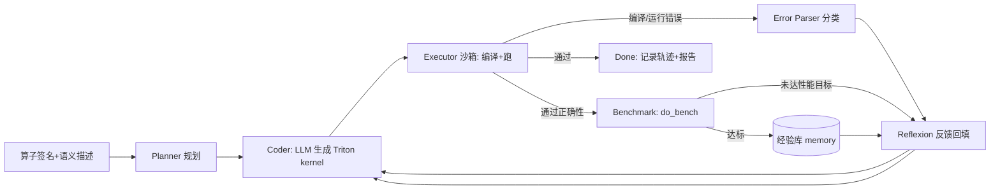

# Triton Kernel Generation Agent — 两周备战计划

> 📌 **进度（2026-09-06 Day2，超前 10+ 天）**：M1 稳健评测 **12/12 通过**（4 算子 × repeat 3，平均 1.7 轮，fp32+fp16 多 case 判卷）；双 critic 性能闭环；RAG 经验库 v1（memory.py）骨架完成。计划内已覆盖 Day1–5/7/8–9/11–12；剩 D6(可选角色拆分)、D13–14(demo/简历)。见 §8/§10。

> 目标岗位：大模型算法 / Agent 应用
> 前置背景：写过/读过一些 Triton；LLM API 驱动（DeepSeek/OpenAI 兼容）
> 可用时间：约 4–6 h/天（总计 ~70 h）
> 项目定位（简历一句话）：
> **基于 LLM 的自主 Triton kernel 生成与优化 Agent** —— 输入 PyTorch 算子的签名/语义描述，自动规划、生成 Triton kernel，并通过「编译 → 正确性 → 性能」三重工具反馈驱动 Reflexion 式自我迭代，直到通过数值对齐并达到性能目标。

---

## 0. 前置检查（开工前必须确认，半天）

- [ ] 有可用的 NVIDIA GPU（`nvidia-smi` 可用，显存 ≥ 8G）
- [ ] `torch`(>=2.x) + `triton` 装好且版本匹配，能 import 并跑通一个最小 kernel
- [ ] LLM API key（DeepSeek 国内方便且便宜；OpenAI 兼容格式）
- [ ] git 初始化，确定用哪个 conda/venv 环境

> ⚠️ 没有 GPU 是硬性 blocker，Triton 在 CPU 上基本无法实战。先确认再往下走。

---

## 1. 总体策略（先讲清楚为什么这么做）

你投的是 **Agent 岗**，不是 AI Infra 岗。所以：

- **卖点是 agent 架构能力**：tool-use（执行/编译/基准测试）、多轮自我纠错（Reflexion）、可观测轨迹、成本控制。Triton 只是"验证沙箱"。
- **不要沉进编译器深水区**（tuning 数万核、研究级 flash-attention 等是 AI Infra 方向才需要的），两周内浅尝辄止即可。
- **用机器可量化的指标给 agent 打分**：正确性（vs PyTorch eager）、性能（vs torch.compile / eager）。这是你项目区别于"玩具对话 agent"的核心竞争力。
- **尽量自写 orchestrator，不套 LangChain/LangGraph 大框架**。面试时你能把每个角色（planner/coder/critic）和循环讲透，框架反而削弱说服力。

### 里程碑（3 个硬性验收点）

| 里程碑 | 时间 | 验收标准 |
|---|---|---|
| M1 正确性闭环 | Day 1–7 | 5 个算子中 ≥4 个能由 agent 自动生成**通过数值对齐**的 kernel；平均迭代 ≤3 轮 |
| M2 性能闭环 | Day 8–11 | 跑出可信对比表（vs eager / torch.compile），kernel 有可复现的 benchmark |
| M3 交付打磨 | Day 12–14 | README + 架构图 + 轨迹记录 + demo 脚本 + 简历条目 + 面试问答 |

---

## 2. 两周 Day-by-Day

### Week 1 — 把"自动生成 + 自动验证"的闭环跑通

| 天 | 内容 | 产出 |
|---|---|---|
| D1 | 环境验证；Triton 手写热身（vector add / elementwise / 一个 reduce）；搭 repo 骨架 | 最小 kernel 跑通；项目结构就位 |
| D2 | **定义 benchmark 集（这是地基）**：选 5 个算子，写 golden 正确性检查脚手架（`torch.allclose`）与输入生成器；手写 reference Triton 留存（只作答案，不喂给 agent） | `benchmarks/` 各算子 runner 跑通 |
| D3 | **Agent v0 最小闭环**：LLM 生成 kernel → 落盘 → 独立子进程编译+正确性 run → 返回 pass/fail | 固定 prompt 单轮生成能跑通 1 个算子 |
| D4 | **错误反馈解析器**：把编译错误 / 运行错误 / 数值错误分类成可消化文本；加自动重试（最多 K 轮） | 简单算子能自动迭代到正确 |
| D5 | **Reflexion 反思循环 v1**：按错误类别组织历史反馈回填 prompt；把"Triton 生成规范"沉淀进 system prompt | 记录轨迹 jsonl；成功率明显上升 |
| D6 | 抽出 **planner / coder / critic 角色模块**（体现 agent 架构）；加 mock LLM 便于离线调试 | 架构清晰、可离线单测 |
| D7 | **M1 验收**：5 个算子全量跑，统计成功率/平均轮数/耗时；处理 triton API 版本坑（`libdevice` 导入、`tl.max` 返回值、`num_warps` 等） | M1 指标表 |

### Week 2 — 性能闭环 + 打磨交付

| 天 | 内容 | 产出 |
|---|---|---|
| D8 | **性能基准工具**：`triton.testing.do_bench` 计时，对比 torch.compile / eager；定性能 critic 与目标阈值 | benchmark 工具 + 阈值策略 |
| D9 | **性能反思循环**：不达标时给优化建议轮（block size / num_warps / 向量化 / 循环展开 hints），调 vector add / softmax | 至少 1–2 个算子达到目标 |
| D10 | 加 **1 个难算子**（GEMM 用 `tl.dot`，或 flash-attention 简化版）；引入"经验库 memory"：让 agent 参考此前成功 kernel，体现记忆机制 | 难算子有进展；memory 模块 |
| D11 | **M2 全量评测**：全算子跑表（成功率 / 加速比 / 迭代轮数 / token 成本），产结果图 | M2 数据 + 图表 |
| D12 | 工程化：CLI 配置（模型/预算/超参）、进程超时与错误边界、日志；**可选**：streamlit/gradio 展示 demo（对 Agent 岗加分） | 可复现工程 |
| D13 | README 打磨（架构图+工作流+结果表）；写 5 分钟面试 demo 脚本；准备技术问答 | 文档 + demo |
| D14 | 简历条目打磨 + 缓冲（复盘可量化产出、准备被 challenge 的问题） | 简历就绪 |

> ⏱️ 时间不够时的**砍单顺序**：先砍 D10 难算子，再砍 D12 demo。**核心交付保住：正确性闭环 + 性能对比 + README/架构图**。宁可做小做透，不要半成品。

---

## 3. 建议项目结构

```
triton_kernel_agent/
├── benchmarks/                 # 算子集：签名/描述/输入生成器/golden
│   ├── ops_registry.py         # 每个算子的元信息（语义描述 + 类型 + shape 约束）
│   ├── runner.py               # 子进程内执行：编译 + 正确性断言
│   └── ops/
│       ├── vector_add.py       # (每个算子: generate_inputs + golden + reference)
│       ├── softmax.py
│       └── ...
├── agent/
│   ├── main.py                 # CLI 入口
│   ├── loop.py                 # orchestrator 主循环
│   ├── roles/
│   │   ├── planner.py          # 拆解：选策略/网格设计思路
│   │   ├── coder.py            # 生成 kernel（调 LLM）
│   │   └── critic.py           # 正确性 critic + 性能 critic
│   ├── memory.py               # 经验库：成功 kernel / 常见坑 / 跨任务复用
│   ├── tools/
│   │   ├── executor.py         # 沙箱执行（subprocess + timeout + 独立进程）
│   │   ├── error_parser.py     # 编译/运行/CUDA 错误分类
│   │   └── benchmark.py        # do_bench + 对比 torch.compile
│   └── llm/
│       ├── client.py           # DeepSeek/OpenAI 兼容 client（可切模型）
│       └── prompts.py          # 系统提示词 + 反馈模板
├── results/                    # 每次运行的轨迹 jsonl + 汇总报告
├── scripts/                    # run_benchmark.sh / demo.py
├── PLAN.md
└── README.md                   # 架构图 + 工作流 + 结果表 + 快速开始
```

### Agent 工作流（画进 README 的架构图）



关键设计点（面试要能讲）：
1. **沙箱隔离**：生成的不可信代码跑在独立子进程 + timeout，主进程永不崩。
2. **反馈质量决定收敛**：错误分类 + 结构化反馈 > 把原始 stderr 直接丢回给 LLM。
3. **双 critic**：正确性 critic（数值对齐）与性能 critic（达标才停），避免"能跑但很慢"就收工。
4. **Reflexion 而非 ReAct**：一轮一轮把历史失败原因浓缩成"经验"，而不是无限长对话。
5. **可观测 + 可复现**：每轮轨迹存 jsonl，固定 seed，成本/token 可统计。

---

## 4. 推荐技术选型

| 项 | 建议 | 理由 |
|---|---|---|
| LLM | DeepSeek（`deepseek-chat` 日常 / `deepseek-reasoner` 疑难） | 便宜、代码能力强、国内直连；API 与 OpenAI 兼容，之后可无缝换 |
| Agent 框架 | 自写 orchestrator（~几百行） | 面试可讲透；不建议为简历套 LangGraph |
| 执行沙箱 | `subprocess` + `timeout` + 独立 Python 进程 | 隔离不可信代码 |
| 计时 | `triton.testing.do_bench` | 官方标准，自动 warmup |
| 数值容差 | fp32 用 `rtol=1e-2, atol=1e-2` 起步，按算子收紧 | 别一上来全等比对（reduce/softmax 顺序敏感） |
| 版本坑 | 固定 triton/torch 版本到 requirements.txt | 面试复现性 |

---

## 5. 简历条目（成品示例 + 待回填占位 + 诚实降级写法）

### 成品示例（可直接复制；【】内数字做完再回填）

**LLM Agent 驱动的自主 Triton Kernel 生成与优化系统**（个人项目 · 独立完成）
*标签：Agent / Reflexion / Tool-Use / Triton / PyTorch*

**项目概述（一行）**：端到端 Autonomous Coding Agent —— 输入 PyTorch 算子签名与语义描述，自动完成 Triton kernel 的「生成 → 编译 → 数值验证 → 性能调优」闭环，全程零人工介入。

- **多角色 Agent 闭环**：设计并实现 `Planner → Coder → Executor → Critic` 架构，将代码生成、沙箱执行、错误诊断、性能基准封装为可组合工具；以 Reflexion 方式把历史失败原因浓缩回填 prompt，支持自动迭代收敛；全程轨迹 JSONL 持久化、随机种子可复现。
- **沙箱隔离与结构化反馈**：基于独立子进程 + 超时机制执行不可信生成代码，主进程零崩溃；将编译错误 / CUDA 运行时错误 / 数值偏差分类解析为结构化诊断，替代"原始 stderr 直接回传"，显著提升模型修正质量。
- **双 Critic 终止策略**：正确性以 PyTorch eager 数值对齐为准；性能用 `triton.testing.do_bench` 计时并与 `torch.compile` 对比，**两者同时达标才终止**，避免"能跑但慢"的次优收敛。
- **经验库与量化结果**：跨算子记忆成功 kernel 与常见踩坑模式；在【5】类算子（elementwise / reduce / softmax / GEMM 等）上实现【≥80%】自动生成成功率、平均【≤3】轮内收敛；生成 kernel 相对 PyTorch eager 平均加速【S×】，对齐/优于 torch.compile。
- **成本可控**（可选，时间够再加）：单算子 token 与迭代预算可配置并计入轨迹，约束长尾任务的探索开销。

### 三条红线
1. **数字必须是真的**：面试官会深挖（怎么测加速比、对比基线 shape、warmup 次数），写多少就要能现场复现；占位符宁可提交前最后一天再填，不要编。
2. **达不到预期就诚实降级**（一样成立、不减分）：
   - 难算子没做成 → 写成"elementwise / reduce / softmax 等 4 类算子"，范围如实际；
   - 没超越 torch.compile → 写"与 torch.compile 相当 / 特定 shape 下更优"；
   - 成功率 70% → 写 70%，不要四舍五入。
3. **叙事重心放 Agent**（架构/反馈/critic），数字只是佐证，别被带进 CUDA 调参细节泥潭。

### 面试官大概率会问的 5 个问题（为它们积累素材）
1. agent 怎么知道什么时候该停？（→ 双 critic 设计）
2. 反馈给 LLM 的信息做了哪些加工？为什么不是直接丢报错？（→ 错误分类解析）
3. 怎么防止模型胡编乱造 kernel？（→ 机器 ground truth：编译 + 数值对齐把关）
4. 举一个失败案例，怎么归因和修复？（→ 保留 1–2 个真实失败轨迹，能讲清楚）
5. 为什么用 Triton 而不是让模型直接写 CUDA / 为什么不用 torch.compile？（→ 准备 30 秒答案）

---

## 6. 风险与对策

| 风险 | 对策 |
|---|---|
| 没有/显存不足的 GPU | 开工前确认；不行换思路（项目改纯 CPU/伪执行不成立，务必先验 GPU） |
| LLM 写的 Triton 一次通过率低 | 这是项目本身要解决的"问题"，反而成为亮点；用高质量 system prompt + 结构化反馈压低轮数 |
| Triton API 版本差异导致参考代码过时 | requirements.txt 锁版本；以本机 triton 为准 |
| 范围失控（陷进调优/研究） | 严守砍单顺序：难算子/demo 都可砍，闭环+对比+文档不可砍 |
| 4–6h/天被打断 | 以里程碑而非天为单位推进；D7/D11 是两个保底检查点 |

---

## 7. 两周后可继续的进阶方向（若提前完成或想加分）

- 支持更多难算子（attention 变体、conv、group-norm）扩覆盖
- 让 agent 读取 kernel 的 SASS/Triton IR 做更深归因（跨到 AI Infra 故事）
- 评估对比不同 base 模型 / 加 RAG（把 triton 官方文档/教程切片检索进上下文）
- 加"预算感知"：per-op 的 max 轮数与 token 上限自适应

---

## 8. 冲刺清单（当前阶段，剩余 ~13 天；按简历含金量/投入排序）

1. 🥇 **性能闭环（核心必做 ~2–3 天）**：`agent/tools/benchmark.py`（do_bench 计时）+ 对比 torch.compile / eager → loop 加**性能 critic**（达标才停）→ 全算子性能表
2. 🥈 **稳健统计（半天）**：每算子跑 2–3 次取成功率（多 seed），结果进 README
3. 🥉 **工程固化（穿插，1 天）**：git 首次提交、README 结果表 + 架构图、`scripts/run_all.py` 批量评测、5 分钟 demo（可录屏）
4. 简历条目回填真实数字（见 §5）

## 9. 扩展路线图（对齐业界 KernelAgent 的能力分层）

- **L1 中等算子**（layer_norm / conv / flash-attn 简化版）：新建 op 模块 + 注册即可，agent 零改动；但需先升级 ①多 case 数值测试（多个 shape 全过才算 pass）②shape 参数化（性能闭环前置）
- **L2 融合/多 kernel**：需扩展 launch 契约（多输出 / 中间 buffer / meta dict）+ prompts 约定；瓶颈 = 我们自己要能写对 reference
- **L3 端到端/整模型**（如 meta-pytorch/KernelAgent 的 Fuser）：需新增图级管线（AST/子图提取 → 并行生成 → composer 拼回 + self-test），属新架构层次，不在两周内
- **配套组件**（难度上升才显价值）：memory.py 经验库、性能 critic、硬件剖析轻量版
- **参考**：github.com/meta-pytorch/KernelAgent（多 worker + NCU/roofline + beam search；与我们一致的核心理念 = 可信 harness + 禁 PyTorch fallback + 数值判卷）

---

## 10. RAG 经验库 v1 设计（蓝图，2026-09-06，未实现）

**动机**：让 agent 有"记忆 + 检索增强"，新算子借鉴同类成功 kernel，目标成功率↑ / 轮数↓；同时补 Agent 岗的 RAG 广度。

**核心诚实约束**：经验库只检索**"相似但 ≠ 当前算子"**的成功样例（同 op 的成功代码 = 答案，直接给 = 作弊/测不出泛化）。我们要证明的是"借鉴同类能否提升对新算子的成功率"，这才是 RAG 的价值。

**v1 范围（零依赖，先证价值）**
1. 数据源：每次 `KernelAgent.run()` 成功时，把最终通过代码写入 `results/memory/`（含 op_name / category / OP_META 摘要 / code / perf 可选项）
2. 存储：简单文件（`results/memory/<op>.json` 或 sqlite），gitignore 已覆盖
3. 检索：按 `OP_META.category`（elementwise / softmax / reduction / gemm）精确匹配 → 取同类**其它算子**的 1–2 个成功 kernel 作参考（可解释、零依赖）
4. 注入点：`prompts.build_initial_messages` 里、user 规格之后追加 `<参考样例(同类算子)>...`；system 注明"仅参考写法，勿照抄结构"
5. **A/B 验证**：`run_all` 加 `--memory on/off`，同一批算子对比成功率/平均轮数；无 memory 基线已有
   - 若证明有效（轮数/成功率改善）→ 数据驱动地升级
   - 若无效/不稳定 → 保留结论，避免"为 RAG 而 RAG"

**升级路径（数据证明需要后再做）**
- v2：真 embedding 相似度（sentence-transformers 或 embedding API），检索更准
- v3：接入 LangChain 检索器 / 纳入 Triton 官方文档 → 编译报错时检索 API 用法（减少过时知识错误）
- 原则：先零依赖证价值，再决定是否引框架（LangChain/LangGraph 分层决策，见会话结论）
