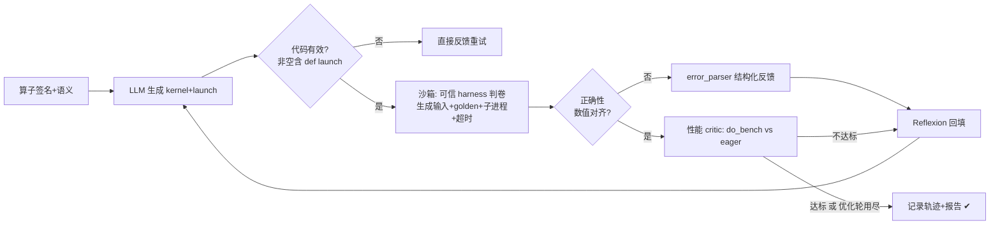

# Triton Kernel Generation Agent

给定 PyTorch 算子签名与语义描述，LLM Agent 自动生成 Triton kernel，并通过「编译 → 数值验证 → 性能调优」闭环自主迭代，直到通过机器打分（正确性对齐 PyTorch、性能达标）。

> 📌 状态（2026-09-06，Day2）：M1 正确性**稳健评测 12/12 通过（100%）**（4 算子 × repeat 3，平均 1.7 轮收敛，每个 kernel 过 fp32+fp16 多 case 判卷）；双 critic（正确性 + do_bench 性能门槛）；硬件精度自适应（sm_80+ 自动切 tf32）；RAG 经验库 v1（memory.py）。代码 ~1700 行，git + GitHub 已同步。

---

## 当前算子集

| 算子 | 类别 | 考察点 | 默认规模 |
|---|---|---|---|
| `vector_add` | elementwise 1D | block + mask | N=2^20 |
| `relu` | elementwise 1D（同族） | block + mask | N=2^20 |
| `softmax` | row-reduce 2D | axis 归约、数值稳定（减 row max） | 1024×1024 |
| `matmul` | GEMM 2D | `tl.dot`、K 循环、fp32 累加 | 128³ |
| `sum_1d` | reduction 1D | 跨 block 归约（两阶段） | N=2^20 |

> 新增算子：在 `benchmarks/ops/` 建模块，然后在 `ops_registry.py` 的 `for _mod in (...)` 里登记即可。

---

## 评测结果（2026-09-06，真实运行）

### 正确性（M1，稳健评测：4 算子 × repeat 3 = 12 次独立生成）

| 算子 | 类别 | 通过 | 平均轮数 | 末轮 err(中位) |
|---|---|---|---|---|
| `vector_add` | elementwise | 3/3 ✔ | 1.0 | 0 |
| `softmax` | row-reduce | 3/3 ✔ | 2.0 | 3.8e-6 |
| `sum_1d` | reduction | 3/3 ✔ | 2.3 | 1.8e-4 |
| `matmul` | GEMM | 3/3 ✔ | 1.3 | 3.9e-3 |

> **12/12 自动生成通过（100%）**，平均 1.7 轮收敛；每个 kernel 均经 **fp32×3 + fp16×2 共 5 组 case**（主/非整除/极小 shape）判卷全对齐才算 pass。matmul 曾 6 轮失败（模型不知 sm_75 需 `input_precision="ieee"`），把硬件约束写入算子规格后 → 1–2 轮通过。

### 性能（do_bench，GTX1650 / sm_75 / 小 shape，趋势参考）

| 算子 | triton(ms) | eager(ms) | vs eager |
|---|---|---|---|
| `vector_add` | 0.076 | 0.076 | 0.997x（带宽饱和型） |
| `softmax` | 0.052 | 0.054 | 1.042x |

> agent 生成 kernel 带性能 critic：`vector_add --perf` 通过时 speedup_vs_eager=0.917x。正式性能对比（含 torch.compile）建议在服务器大 shape 上跑（本机数字仅验证链路）。

## Agent 工作流



---

## 目录结构与职责

| 路径 | 职责 |
|---|---|
| `PLAN.md` | 两周计划、简历成品条目、面试问答清单 |
| `benchmarks/` | **算子集**：被 agent 挑战的"题目"与 ground truth（golden） |
| `benchmarks/ops_registry.py` | op 注册表：`list_ops()` / `get_op(name)` |
| `benchmarks/runner.py` | 单算子自检：`verify_op`（reference vs golden 数值对齐） |
| `benchmarks/ops/<name>.py` | 每个算子一个模块（接口约定见下文） |
| `agent/loop.py` | orchestrator 主循环：双 critic（正确性 + 性能）+ Reflexion + 轨迹 |
| `agent/tools/executor.py` | 沙箱执行器：可信 harness 判卷、子进程隔离、可选 do_bench |
| `agent/tools/error_parser.py` | 错误分类 → 结构化反馈 |
| `agent/tools/benchmark.py` | do_bench 性能基准（vs eager / torch.compile） |
| `agent/llm/` | LLM client（读 .env）+ prompt 模板 |
| `agent/roles/` | Planner / Coder / Critic 角色（待拆分，暂并入 loop） |
| `scripts/check_env.py` | 环境自检：GPU / torch / triton + 最小 kernel 冒烟 |
| `scripts/smoke_test.py` | 全算子冒烟（reference vs golden） |
| `scripts/run_agent.py` | 单算子 agent CLI（支持 `--perf` 双 critic） |
| `scripts/bench.py` | 性能对比表 CLI |
| `scripts/run_all.py` | 批量评测汇总 CLI（`--repeat` 可算成功率） |
| `results/` | 每次 agent 运行的轨迹 jsonl 与汇总报告（gitignore，不入库） |
| `requirements.txt` | 依赖与安装策略说明 |

## 算子模块接口约定

每个 op 模块（`benchmarks/ops/*.py`）须暴露：

- `OP_NAME`：唯一名
- `OP_META`：给 LLM 看的语义/签名/约束（dict）
- `generate_inputs(n=None, device, dtype) -> {x..., meta}`
- `golden(*inputs)`：PyTorch eager 期望结果（机器打分 ground truth）
- `reference_triton(*inputs)`：手写参考 kernel —— **仅供自检，绝不喂给 agent**
- `check(out, ref) -> bool`：数值对齐断言

## 快速开始

```bash
conda activate triton_env
python scripts/check_env.py                          # ① 环境自检（需 GPU）
python scripts/smoke_test.py                         # ② 算子 reference vs golden 全通过
python scripts/run_agent.py softmax                  # ③ 单算子 agent 生成（正确性闭环）
python scripts/run_agent.py vector_add --perf        # ④ 双 critic（含性能门槛）
python scripts/bench.py                              # ⑤ do_bench 性能对比表
python scripts/run_all.py --perf                     # ⑥ 批量评测汇总
```

> 首次运行前在项目根 `.env` 配好 `DEEPSEEK_API_KEY`（已被 .gitignore 忽略）。所有命令建议用 `triton_env` 环境的 python 执行（本机 shell 常停在 base，用绝对路径 `/home/claude/miniconda3/envs/triton_env/bin/python`）。

## 开发约定

- **GPU 分工**：笔记本 GTX1650（4G, sm_75）只做小 shape 冒烟；性能/大 shape/GEMM 在服务器跑。
- **Triton**：用 torch bundled 版本，勿单独 `pip install triton`（避免 sm_75 兼容坑）。
- 手写 `reference_triton` 相当于"答案"，只用于自检 runner，**绝不**出现在喂给 LLM 的上下文里。
